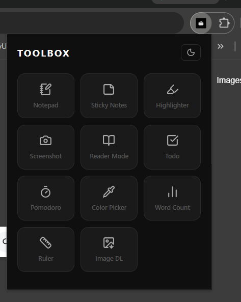
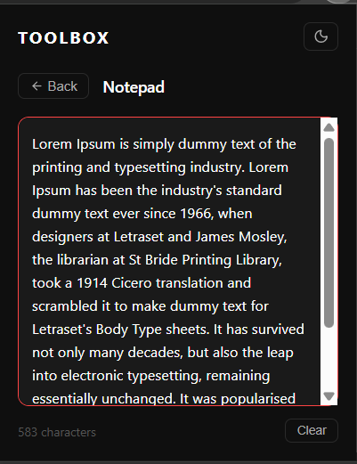
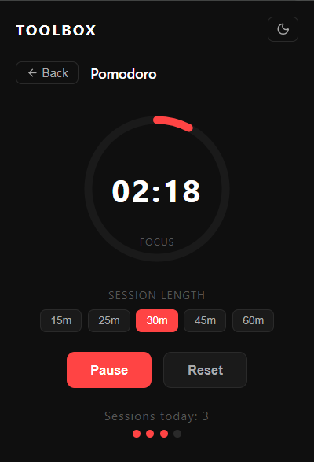
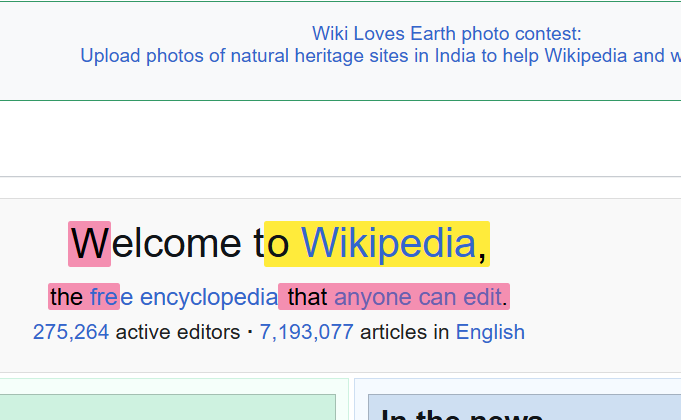

# Toolbox — Browser Extension

A Chrome extension that packs 11 essential productivity 
tools into one place. No more switching between extensions.

## Tools

| Tool | Description |
|------|-------------|
| Notepad | Persistent notes that survive tab switches |
| Todo | Quick task manager with completion tracking |
| Pomodoro | Focus timer that runs in the background |
| Word Counter | Live word, character and read time stats |
| Highlighter | Highlight text on any page with color options |
| Sticky Notes | Draggable notes pinned to any webpage |
| Color Picker | Sample any color from any page |
| Ruler | Measure pixel dimensions on screen |
| Screenshot | Visible area and full page capture |
| Reader Mode | Strip ads and clutter for clean reading |
| Image Downloader | Find and download images from any page |

## Screenshots

  
  

  
  

## Install Locally

1. Clone this repo
git clone https://github.com/djvu2k6/toolbox-extension.git
2. Open Chrome and go to `chrome://extensions`
3. Enable **Developer Mode** (top right toggle)
4. Click **Load Unpacked**
5. Select the cloned `toolbox` folder
6. Toolbox icon appears in your Chrome toolbar

## Chrome Web Store

Coming soon.

## Built With

- Vanilla JavaScript
- Chrome Extensions Manifest V3
- Chrome Storage API
- Chrome Alarms API
- Chrome Scripting API
- Lucide Icons

## Why I Built This

I was tired of having 7 different extensions for 7 simple 
tools. So I built one that has all of them.

Built during my semester break as a learning project and 
portfolio piece.

---

Made by [Dhananjay](https://github.com/djvu2k6)